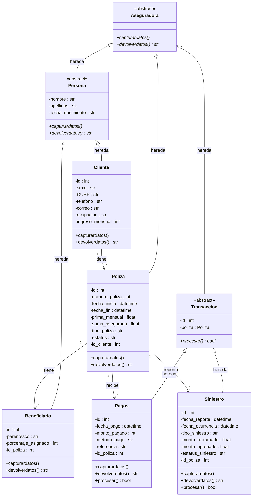
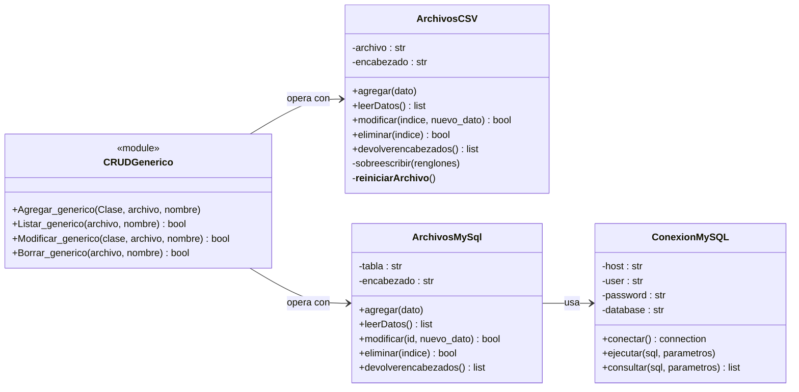
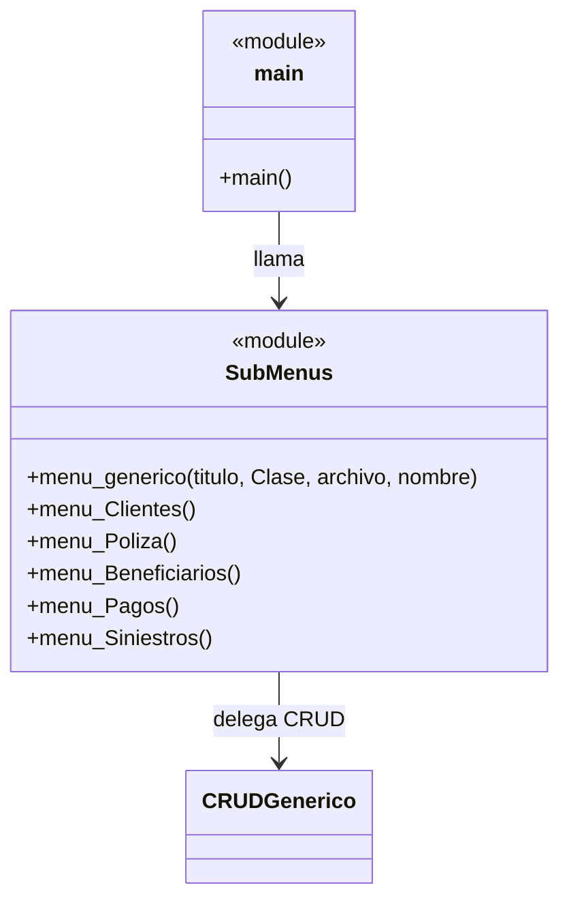
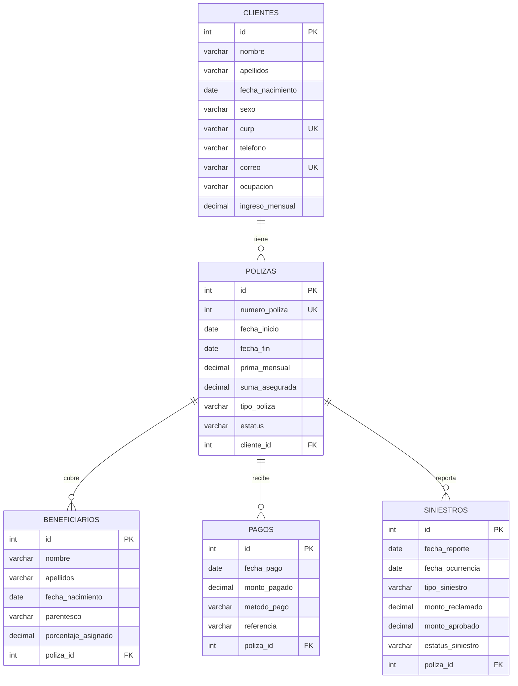

# 📊 Diagrama de Clases UML — Aseguradora VidaFutura

## Diagrama de Herencia (Modelo de Negocio)

## Diagrama de Persistencia (Patrón Estrategia)

## Diagrama de Interfaz de Usuario

## Relaciones en Base de Datos (Modelo E-R)

